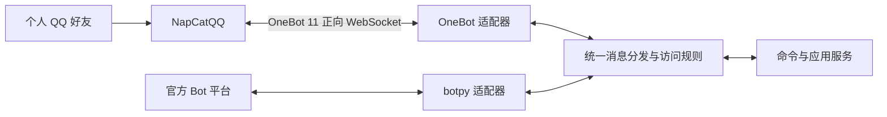

# Kisara 双引擎设计与实施主线

日期：2026-09-19  
状态：M1 部署集成与 OneBot 开发热重载已落地；真实账号收发与连续运行验收仍待实施。

迁移后的功能现状与旧插件取舍见 [docs/legacy-migration.md](docs/legacy-migration.md)。下文是双引擎接入的原始阶段设计；其中“首版不引入数据库/外部服务”和“群内仅 @ 或命令”等阶段性约束已由迁移实现更新：当前用 SQLite 记录定时简报发送，允许已授权群的词库随机回复，并提供外部内容命令。

## 1. 目标与范围

Kisara 面向个人和少数熟人的 QQ 小窗交互。以 NapCatQQ 接入个人 QQ 账号为主要运行方式，保留腾讯官方 Bot 引擎，两种接入共用同一套命令和业务逻辑。

当前决策：

- 默认使用 NapCatQQ + OneBot 11；官方引擎通过配置显式启用。
- 第一版每个 Kisara 进程只运行一个引擎，通过配置切换，不做热切换。
- 优先支持互加好友的私聊文本收发，以用户白名单限制使用范围。
- 保留群会话模型和后续群接入位置，默认不处理群消息。
- 继续使用 Docker 运行开发工具和服务，沿用 `hako`、`dev.sh` 入口。
- 第一版不引入数据库、插件系统、消息队列或 NoneBot，不实现自动跨引擎故障转移。

成功标准：指定好友可以通过小窗使用同一套业务功能；重启和短暂断网后可以恢复；无法恢复时能明确识别原因；切换引擎不需要修改业务代码。

## 2. 已确认现状

依据当前工作区实现，而非仅依据已提交版本：

| 文件或目录 | 当前情况 |
| --- | --- |
| `src/kisara/bot/main.py` | 按配置延迟加载并组装选中的 adapter |
| `src/kisara/bot/adapters/` | 提供官方 botpy 与 OneBot 11 两条协议接入 |
| `src/kisara/bot/contracts.py`、`dispatcher.py` | 提供统一消息契约、白名单、去重和共享文本命令路由（`/ping`、`/help`、`/eat`、`/roll`） |
| `src/kisara/config/settings.py` | 按引擎读取配置；默认 OneBot，仅校验当前引擎 |
| `src/kisara/application/services/` | 提供无外部依赖的骰子和食物推荐用例；食物列表随 Python 包发布 |
| `src/kisara/domain/` | 仍为预留结构，当前本地命令不需要持久化领域模型 |
| `hako`、`dev.sh` | 以 Docker 运行 Python 工具和单个官方 Bot 服务 |
| `deploy/compose.yaml`、`deploy/onebot.sh`、`deploy/kisara-dev-watch.sh` | 提供 Kisara + NapCat OneBot Compose 栈、开发源码热重载；QQ 登录态和 NapCat 配置持久化 |
| `tests/unit/` | 使用合成消息事件覆盖分发与本地命令；离线场景不创建 adapter、不读取引擎凭据 |

OneBot 的协议转换、正向 WebSocket、回执等待和重连骨架已在本仓库实现；NapCat 的 Compose 部署集成已在仓库内实现：NapCat 与 Kisara 使用同一网络，启动脚本生成 NapCat 的 OneBot 11 正向 WebSocket 配置，并将 Token 与 Kisara 配置保持一致。NapCat 首次 QQ 登录和真实好友私聊仍需部署验证。官方 adapter 继续只覆盖已有频道 @ 消息，不能据此认定官方 SDK 不支持群或单聊。

工作区已有未提交改动；后续实施应在这些改动基础上推进，保留无关修改。

## 3. 引擎选型与边界

| 引擎 | 实现 | 登录与连接 | 定位 |
| --- | --- | --- | --- |
| `onebot` | NapCatQQ + OneBot 11 | NapCat 管理个人 QQ 登录；Kisara 通过正向 WebSocket 连接 NapCat | 默认路线，优先好友私聊 |
| `official` | 腾讯 `botpy` SDK | AppID / AppSecret，由 SDK 连接官方平台 | 可选路线，保留已有频道能力 |

适配器命名为 `onebot_v11`，不把 NapCat 专属接口作为业务依赖。未来更换 OneBot 实现仍需兼容性验证，不承诺即插即用。

NapCat 适合进入小范围试运行，但公开 issue 无法证明长期无人值守可靠性，也不能推导故障率。账号掉线、登录失效、QQ 与 NapCat 版本不匹配都可能影响运行。低消息量不能消除这些问题。

官方机器人与个人 QQ 是不同身份，不共享凭据或会话标识。第一版不自动合并身份、同步会话或切换发送账号。

## 4. 总体结构



图中展示两条可选链路；第一版启动时只选择其中一条。

适配器负责连接、协议转换和发送；分发器负责白名单、触发规则和命令路由；应用服务负责业务行为。回复通过原事件所属适配器发送。

依赖方向：启动入口组装各模块；适配器依赖公共消息契约；分发器调用命令和应用服务；应用服务不得依赖 `botpy` 或 OneBot 原始数据结构。

## 5. 目标目录

以下是按阶段逐步落地的目标，不要求预先创建全部空文件。

```text
.
├── design.md
├── readme.md
├── pyproject.toml
├── .env.example
├── start.sh                          # 选择引擎并启动服务
├── hako                              # 一次性开发、测试命令
├── dev.sh                            # 按引擎启动和停止开发服务
├── config/                           # 非敏感配置模板；不放真实登录态
├── deploy/
│   └── compose.yaml                  # Kisara 与可选 NapCat 服务
├── docs/
│   └── operations.md                 # 登录、升级、回滚、故障排查与试运行记录
├── src/kisara/
│   ├── __main__.py                   # 保留 python -m kisara 入口
│   ├── config/
│   │   └── settings.py               # 公共配置及按引擎校验
│   ├── bot/
│   │   ├── main.py                   # 选择引擎、组装依赖、管理生命周期
│   │   ├── contracts.py              # 消息、会话、回复上下文和适配器接口
│   │   ├── dispatcher.py             # 白名单、事件筛选、触发与命令路由
│   │   ├── commands/
│   │   │   └── ping.py               # 最小端到端命令
│   │   └── adapters/
│   │       ├── official.py           # 从现有 client.py 迁入官方 SDK 对接
│   │       └── onebot_v11.py         # OneBot 事件转换、请求回执、重连
│   ├── application/
│   │   └── services/                 # 共享业务用例，例如骰子和食物推荐
│   ├── domain/                       # 有真实领域概念后再填充
│   │   ├── models/
│   │   └── repositories/
│   ├── infrastructure/
│   │   ├── integrations/            # 后续外部服务，不重复放 QQ 适配器
│   │   ├── persistence/             # 有持久化需求后再实现
│   │   └── logging/                 # 脱敏与运行日志配置
│   ├── resources/                    # 版本管理的静态资源，例如食物列表
│   └── shared/                      # 仅存放实际复用的基础定义
└── tests/
    ├── unit/                        # 配置、转换、路由、访问规则
    ├── integration/                 # 模拟协议端与连接恢复
    └── fixtures/                    # 脱敏事件样本
```

`bot/events/` 现有预留目录暂不扩展：协议事件解析留在适配器。`contracts.py` 属于机器人接入契约，不把协议概念塞进 `domain`。

`onebot_v11.py` 初期保持一个模块；只有连接管理与消息转换明显复杂时再拆分。官方依赖采用可选依赖或延迟导入，使 OneBot 模式不受未安装官方 SDK 影响。

## 6. 消息与能力契约

统一消息至少包含：

| 字段 | 含义 |
| --- | --- |
| `engine`、`instance_id` | 来源引擎和机器人实例 |
| `message_id` | 原平台消息标识，按字符串处理 |
| `conversation_kind` | `private`、`group` 或 `channel` |
| `conversation_id`、`sender_id` | 平台范围内的会话和发送者标识 |
| `segments` | 结构化消息段；首期处理文本，保留 @ 和引用语义 |
| `reply_context` | 适配器发送回复需要的上下文，由适配器解释 |

会话键使用 `(engine, instance_id, conversation_kind, conversation_id)`；事件去重键还应包含消息标识。不得假设官方用户标识与 QQ 号相等。

适配器提供启动、关闭、回复、状态查询等最小接口。主动发送与被动回复分开建模，因为权限和上下文约束可能不同。未来按需要增加图片、引用、撤回等能力标记；不支持的操作明确返回失败，不能悄悄丢弃消息段。

首期处理路径：

1. 适配器接收并解析事件，区分消息、通知、心跳和 API 回执。
2. 过滤自身消息；OneBot 还应关闭不需要的自身消息上报。
3. 校验会话类型和用户白名单；群功能关闭时直接忽略群事件。
4. 对已处理消息做有容量和期限限制的内存去重。
5. 将合格消息交给命令或应用服务；同一会话按序处理。
6. 通过来源适配器发送回复，检查回执并记录结果。

第一版不承诺进程重启后的严格去重、恰好一次处理或断线期间消息完整补收。队列必须有界，避免离线恢复或突发消息导致无限积压。

## 7. 配置与部署

建议配置示例（字段为待实现设计）：

```dotenv
KISARA_ENGINE=onebot
KISARA_INSTANCE_ID=personal
KISARA_ALLOWED_USERS=123456789,987654321
KISARA_GROUPS_ENABLED=false
KISARA_ALLOWED_GROUPS=

# onebot 模式；3001 是本项目约定端口，需要在 NapCat 中同步配置
ONEBOT_WS_URL=ws://napcat:3001
ONEBOT_ACCESS_TOKEN=replace-with-a-secret

# official 模式；保留已有名称及 APP_ID / APP_SECRET 别名
AppID=
AppSecret=
```

- 默认引擎为 `onebot`；现有官方用户迁移时必须显式设置 `official`，文档说明这一默认行为变化。
- 只校验当前引擎的必需配置；未知引擎直接报错退出。
- 私聊白名单为空时不接受任何用户，不解释成允许所有人。
- 群功能启用后仍需群白名单；群内默认要求 @ 或明确命令。
- OneBot Token 必填，不写入日志、版本库或示例凭据。

运行安排：

- `hako` 继续承担一次性开发和测试命令，不负责启动整套服务。
- `dev.sh` 根据引擎选择启动路径，统一委托 Compose 管理服务；不同时维护两套独立容器启动逻辑。
- `onebot-dev` 使用源码挂载和 watcher 只重启 Kisara 进程；NapCat 与 QQ 登录态不随源码变化重启。
- Compose 中生产 Kisara、开发 Kisara 和 NapCat 共用一套定义；每次只启动一个 Kisara 服务，官方模式不启动 NapCat。
- 两个容器通过同一个项目网络通信。OneBot 端口不映射到宿主机；管理页面仅绑定宿主机 `127.0.0.1`，远程使用通过 SSH 隧道访问。
- NapCat 配置和 QQ 登录态放入独立持久卷，不能因重建 Kisara 容器丢失；普通停止命令不删除这些卷。
- QQ 登录凭据和状态由 NapCat 管理，Kisara 不保存 QQ 密码；首次扫码和必要时重新扫码由用户完成。
- 选定上游推荐且经过验证的 NapCat、QQ 版本组合，固定镜像标签或 digest；升级前保留配置与状态备份。具体镜像和版本在实施时核实。
- 停止和清理仅作用于本项目服务，保留现有脚本对资源作用域的约束。

## 8. 稳定性与隐私

### 运行状态与恢复

分别记录：Kisara 进程运行状态、OneBot 连接状态、QQ 登录状态、最近收发结果。容器存活或 WebSocket 连接成功不能替代端到端收发验证。

连接失败采用有上限的指数退避并加入抖动；重连后查询登录状态。QQ 登录失效时给出需要人工处理的状态，不靠无限重启试图恢复。第一版通过终端日志和本地状态查看暴露问题，不额外接入通知服务。

API 请求使用 `echo` 关联回执，设置超时并清理挂起请求；断线时结束对应等待。发送超时可能意味着“已发送但回执丢失”，默认不自动重发。协议明确返回失败、连接断开、登录失效和发送结果未知应分别记录。

### 隐私边界

选择个人 QQ 接入不能让消息绕过 QQ 平台。用户提到的官方 Bot 数据分析条款尚未逐条核实，本文不宣称 NapCat 消除了平台侧的数据处理。

项目可控制的默认行为：

- Kisara 不记录消息正文、原始事件、Token 或登录二维码，不持久化聊天历史。
- NapCat 也需检查并限制消息日志和调试日志；仅关闭 Kisara 的日志不代表整条链路不留痕。
- QQ 客户端和 NapCat 的持久卷可能包含缓存及会话数据，不承诺磁盘上不存在聊天数据；备份按敏感数据管理。
- 白名单在调用业务或外部服务前执行，但不能阻止 QQ / NapCat 收到账号本身的其他消息。
- 暂不引入云端模型、分析服务或第三方插件。未来新增外部服务时，再明确哪些内容会发送给谁、保存多久。

### 可选私聊 setu 归档

现有可配置功能统一按 `config/features/<name>/config.toml` 读取独立配置：`chat`、`tarot`、`news`、`source`、`music`、`love` 和 `setu`。每个目录提供 `config.toml.example`；功能 TOML 中已给出的字段优先于旧环境变量。聊天和塔罗的群级覆盖项归各自功能文件，旧 `config/groups.json` 仍可作为兼容回退。

`config/features/setu/config.toml` 启用后，归档功能仅处理同时位于全局白名单和功能白名单中的 OneBot 私聊用户。配置独立于接入凭据与其他功能；缺少该文件时归档功能关闭。普通图片和直接发送的合并转发不触发归档回复。用户引用合并转发并发送 `/setu` 后，该转发形成一个批次，立即生成确认提示；随后可用 `/setu` 或配置中的原有确认词保存，取消词保持有效。合并转发递归展开设有深度和节点上限。白名单用户引用图片并发送 `/export-img`、`导出` 或 `转图片` 时，导出工作流将原始图片逐张作为文件附件发送，保留原始字节及动画，避免 QQ 将再次发送的图片归类为不可保存的表情；此操作优先于归档且不依赖归档配置。

应用工作流负责单条合并转发的确认和逐项保存状态；`export_img` 工作流负责识别导出命令、挑选引用图片并确定附件名称；OneBot 适配器提供引用消息读取、展开转发、解析媒体地址和文件发送能力。最后的附件处理通过 `SetuProcessor` 接口注入，现有实现支持按日期保留原名，或以时间戳加 SHA-256 命名。批次元数据和完成状态进入 `KISARA_STATE_DIR` 下的 SQLite；用户确认后的媒体进入单独的 `save_root`，Compose 将其映射到宿主机 `data/kisara/setu`。结果消息包含实际保存目录。未确认的媒体不由 Kisara 下载。该可选行为是上文“不持久化聊天历史”默认原则的明确例外，配置者需按敏感数据管理状态卷和归档目录。

## 9. 实施主线

主线围绕“可靠的小窗交互”推进。每阶段形成可运行、可验证的增量，不因目录规划提前堆积抽象。

| 阶段 | 工作内容 | 完成标准 |
| --- | --- | --- |
| M0：提取接入边界 | 现有 `client.py` 迁入官方适配器；提取消息契约、分发器和共享回声处理；增加引擎配置 | 显式选择官方引擎后，既有频道 @ 回声行为可用；缺配置在连接前失败 |
| M1：私聊最小闭环 | NapCat 独立服务、正向 WebSocket、好友文本收发、白名单、`/ping`；更新配置示例与启动文档 | OneBot 模式无需官方凭据即可启动；指定好友能收到回复；其他用户及群消息不触发业务 |
| M2：连接与发送可靠性 | 心跳、登录状态、重连、请求超时、回执关联、去重、自身消息过滤、同会话顺序与有界队列 | 模拟断线能恢复；发送结果未知时不盲目重发；自身消息不形成回复循环 |
| M3：真实小范围验证 | 使用专用账号连续试运行 7 天；固定版本并记录恢复操作 | 无未解释的漏回或重复回复；登录干预和中断可追踪；能据记录决定是否适合日常使用 |
| M4：按需要扩展 | 私聊图片与引用；可选群白名单和 @ 触发；官方普通群与好友单聊 | 每项能力分别验证，不影响已通过的小窗链路 |

M0–M3 是当前主线；M4 是后续范围。业务能力、AI 服务、同时运行两种引擎、历史持久化均不作为首期前置条件。

当前 M1 已完成代码与部署集成验证，但尚未完成真实账号登录、私聊收发、断线恢复和隐私边界的现场验收。

官方引擎补齐普通群和单聊时，以当时 SDK 示例和账号已获权限为依据，区分代码缺失、平台未授权和平台拒绝，不假设它与个人 QQ 能力完全一致。

## 10. 验证与试运行

自动验证采用 Docker 内的项目测试命令，优先验证真实边界：

- 配置：引擎选择、按引擎校验、未知值拒绝、空白名单拒绝访问。
- 事件：好友文本转换、身份命名空间、群事件关闭、自身消息过滤和重复事件。
- 协议：使用模拟 OneBot WebSocket 服务验证回执关联、乱序回执、失败回执、超时、断线和重连，不依赖真实账号运行 CI。
- 隔离：OneBot 模式不加载或要求官方 SDK；共享业务不引用协议对象。

真实 QQ 验收由用户账号配合，覆盖：

1. 白名单好友小窗 `/ping` 和连续文本交互。
2. 非白名单好友与群消息不会触发业务。
3. 闲置一夜后的首次回复。
4. 分别重启 Kisara、NapCat，检查登录态与消息收发。
5. 短暂网络中断后恢复，检查重复回复和积压消息。
6. 登录失效能被识别；重新登录后可以恢复。
7. 日志中无消息正文、Token 和二维码等敏感内容。

7 天是项目建议的观察窗口，不是上游稳定性保证。记录版本组合、预期交互次数、成功与失败次数、重复回复、恢复时间和人工扫码次数；试运行记录不保存聊天内容。不以“没有报错”替代收发结果检查。

## 11. 参考与证据限制

以下在本次规划中查阅，issue 为特定时间和版本的用户报告，不代表当前版本必然存在同样问题；关闭状态也不等于已核实修复版本。

- [NapCatQQ 项目](https://github.com/NapNeko/NapCatQQ)
- [NapCat 网络配置：正向与反向 WebSocket](https://napneko.github.io/config/basic)
- [NapCat 发布记录](https://github.com/NapNeko/NapCatQQ/releases)：查询时最新标记为 v4.18.28；不是本项目已经验证的版本。
- [#1726：异常反复掉线](https://github.com/NapNeko/NapCatQQ/issues/1726)：2026-03，4.17.53，报告包含低消息量下掉线。
- [#1477：快速登录失败](https://github.com/NapNeko/NapCatQQ/issues/1477)：2025-12，4.9.98，提示需要验证重启后的实际登录状态。
- [#1576：单向好友合并转发失败](https://github.com/NapNeko/NapCatQQ/issues/1576)：2026-02，4.14.8，首期避开此类会话及消息类型。
- [#1852：QQ 升级导致部分接口失效](https://github.com/NapNeko/NapCatQQ/issues/1852)：2026-05，4.18.2，说明需要验证版本组合。
- [腾讯 botpy 示例](https://github.com/tencent-connect/botpy/tree/master/examples)：含频道、群和好友单聊示例。

实施前仍需确认：部署主机架构、选用镜像及 QQ 版本、实际测试账号和好友白名单。它们影响具体运行配置，不阻碍当前目录与模块边界的确定。
